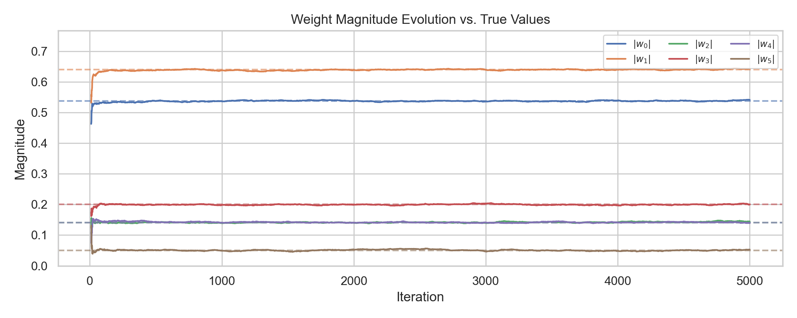
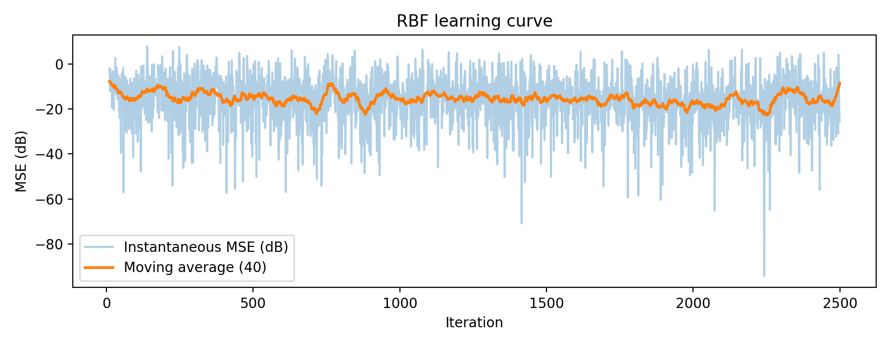
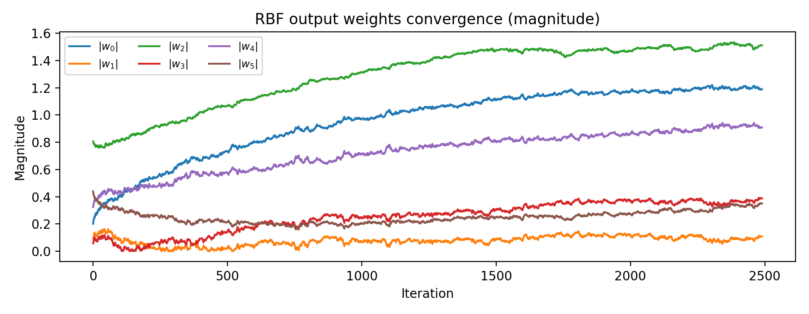
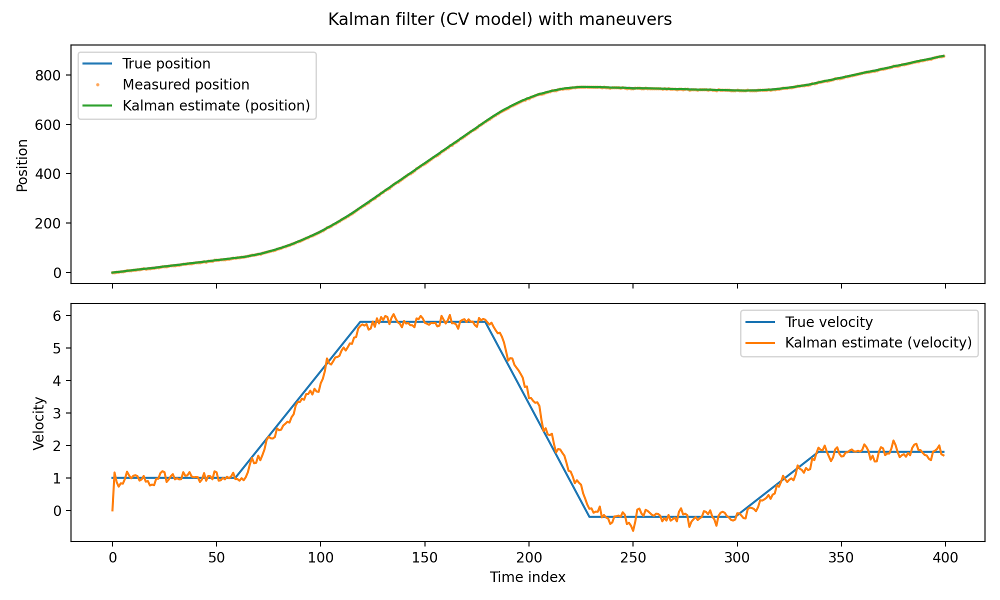
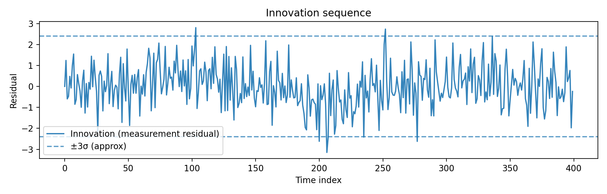

# pydaptivefiltering

<p align="center">
  <strong>Adaptive filtering in Python</strong><br>
  Implementations based on <em>Adaptive Filtering: Algorithms and Practical Implementation</em> (Paulo S. R. Diniz).
</p>

<p align="center">
  <a href="https://pypi.org/project/pydaptivefiltering/">
    
  </a>
  <a href="https://BruninLima.github.io/pydaptivefiltering/index.html">
    
  </a>
  <a href="https://github.com/BruninLima/PydaptiveFiltering/blob/main/LICENSE.md">
    
  </a>
</p>


## 📌 Table of Contents
* [Installation](#install-instructions)
* [Usage Examples](#quickstart-60-seconds)
* [Algorithms & Progress](#algorithms-overview)
* [License](#-license)

---

## Install

```bash
pip install pydaptivefiltering
```

### Requirements

- Python **3.10+** (tested on <!-- PYTHON_VERSION_TESTED e.g. 3.12 -->)
- NumPy, SciPy

---

## Quickstart (60 seconds)

All algorithms follow the same pattern:

1. Instantiate the filter/model
2. Run `optimize(input_signal, desired_signal)`
3. Inspect `outputs`, `errors`, `coefficients`, and optional `extra`

Returned dictionary keys:
- `outputs`: model output
- `errors`: error sequence (see `error_type`)
- `coefficients`: coefficient history (snapshots over time)
- `runtime_s`: runtime in seconds
- `error_type`: `"a_priori"`, `"a_posteriori"`, or `"output_error"`
- `extra`: optional internal states (when enabled)


### System identification (Complex example with RLS):

```python
import numpy as np
import pydaptivefiltering as pdf

rng = np.random.default_rng(0)

# True system (complex FIR)
w_true = np.array([0.5+0.2j, -0.4+0.5j, 0.1-0.1j, 0.2+0j, -0.1+0.1j, 0.0+0.05j])
M = len(w_true) - 1

# Data
N = 5000
x = (rng.standard_normal(N) + 1j*rng.standard_normal(N)) / np.sqrt(2)
noise = 0.05 * (rng.standard_normal(N) + 1j*rng.standard_normal(N)) / np.sqrt(2)

# Desired: d[k] = w^H x_k + noise
x_pad = np.concatenate([np.zeros(M, dtype=complex), x])
d = np.array([np.vdot(w_true, x_pad[k:k+M+1][::-1]) for k in range(N)]) + noise

# RLS
rls = pdf.RLS(filter_order=M, delta=1.0, forgetting_factor=0.995)
res = rls.optimize(x, d)
```

<!-- PLACEHOLDER: Put a convergence plot screenshot here -->
<p align="center">
  
</p>

---

### Example: Neural Adaptive Filtering (MLP)

Nonlinear system:
\[
d(k) = x(k)^2 + 0.5\,x(k-1) + \eta(k)
\]

```python
import numpy as np
import matplotlib.pyplot as plt
import pydaptivefiltering as pdf

rng = np.random.default_rng(1)

N = 3000
x = rng.uniform(-1, 1, N)
d = np.zeros(N)
for k in range(1, N):
    d[k] = (x[k]**2) + 0.5*x[k-1] + 0.01*rng.standard_normal()

mlp = pdf.MultilayerPerceptron(
    n_neurons=8,
    input_dim=3,
    step_size=0.01,   # Keep consistent with the library API
    momentum=0.9,
    activation="tanh",
)

res = mlp.optimize(x, d)

plt.plot(10*np.log10(res["errors"]**2 + 1e-12), alpha=0.8)
plt.title(f"MLP Convergence (Final MSE: {np.mean(res['errors'][-500:]**2):.6f})")
plt.xlabel("Iteration")
plt.ylabel("Squared Error (dB)")
plt.show()
```

<p align="center">
  
</p>

<p align="center">
  
</p>


---

### Example: [Kalman Filter Tracking (Constant-Velocity with Maneuvers)](examples/Jupyter%20Notebooks/Kalman%20Filter/Kalman.ipynb)

arget-tracking example using a 2-state constant-velocity (CV) Kalman filter (position/velocity). The target performs piecewise acceleration maneuvers, 
while we measure position only with additive noise; the filter estimates both position and velocity from the noisy measurements.

```python
import numpy as np
import pydaptivefiltering as pdf

rng = np.random.default_rng(7)

# 1) Synthetic target: constant-velocity model with acceleration maneuvers
N, dt = 400, 1.0
x_true = np.zeros((N, 2), dtype=float)   # [pos, vel]

a = np.zeros(N)
a[60:120]  =  0.08
a[180:230] = -0.12
a[300:340] =  0.05

x_true[0] = [0.0, 1.0]
for k in range(1, N):
    pos_prev, vel_prev = x_true[k - 1]
    x_true[k, 1] = vel_prev + a[k] * dt
    x_true[k, 0] = pos_prev + vel_prev * dt + 0.5 * a[k] * dt**2

sigma_meas = 0.8
y = x_true[:, 0] + sigma_meas * rng.standard_normal(N)

# 2) Kalman filter (CV: position/velocity), measuring position only
A = np.array([[1.0, dt],
              [0.0, 1.0]])

C_T = np.array([[1.0, 0.0]])  # shape (p=1, n=2)

sigma_a = 0.15
Q = (sigma_a**2) * np.array([[dt**4/4, dt**3/2],
                             [dt**3/2, dt**2]])

Rn  = Q
Rn1 = np.array([[sigma_meas**2]])

kf = pdf.Kalman(
    A=A,
    C_T=C_T,
    Rn=Rn,
    Rn1=Rn1,
    x_init=np.array([y[0], 0.0]),
    Re_init=np.eye(2) * 50.0,
)

res = kf.optimize(y)

x_hat = res.outputs
innov = res.errors

# 3) Tiny diagnostics (good for README)
rmse_pos = np.sqrt(np.mean((x_hat[:, 0] - x_true[:, 0])**2))
rmse_vel = np.sqrt(np.mean((x_hat[:, 1] - x_true[:, 1])**2))

print(f"RMSE position: {rmse_pos:.3f}")
print(f"RMSE velocity: {rmse_vel:.3f}")
print(f"Innovation std: {innov.std():.3f}")
```

<p align="center">
  
</p>

<p align="center">
  
</p>


---

## Algorithms (overview)

> This is an overview. For the full list, check the documentation: <a href="https://BruninLima.github.io/pydaptivefiltering/index.html">Docs</a>
Algorithms categories are based on the chapters of the book <em>Adaptive Filtering: Algorithms and Practical Implementation</em> (Paulo S. R. Diniz).

| Module / Category | Exported classes (examples) | Data type |
|---|---|---|
| `lms/` (LMS family) | `LMS`, `NLMS`, `AffineProjection`, `SignData`, `SignError`, `DualSign`, `LMSNewton`, `Power2ErrorLMS`, `TDomainLMS`, `TDomainDCT`, `TDomainDFT` | Real/Complex |
| `rls/` (RLS family) | `RLS`, `RLSAlt` | Complex |
| `set_membership/` (Set-membership) | `SMNLMS`, `SMBNLMS`, `SMAffineProjection`, `SimplifiedSMAP`, `SimplifiedSMPUAP` | Complex |
| `lattice/` (Lattice-based RLS) | `LRLSPosteriori`, `LRLSErrorFeedback`, `LRLSPriori`, `NormalizedLRLS` | Real/Complex |
| `fast_rls/` (Fast Transversal RLS) | `FastRLS`, `StabFastRLS` | Complex |
| `qr_decomposition/` (QR-RLS) | `QRRLS` | Real |
| `iir/` (Adaptive IIR) | `ErrorEquation`, `GaussNewton`, `GaussNewtonGradient`, `RLSIIR`, `SteiglitzMcBride` | Real/Complex |
| `nonlinear/` (Nonlinear models) | `VolterraLMS`, `VolterraRLS`, `BilinearRLS`, `RBF`, `ComplexRBF`, `MultilayerPerceptron` | Real/Complex |
| `subband/` (Subband) | `OLSBLMS`, `DLCLLMS`, `CFDLMS` | Real |
| `blind/` (Blind equalization) | `CMA`, `Godard`, `Sato`, `AffineProjectionCM` | Complex |
| `kalman/` (Kalman) | `Kalman` | Real |
| `base/` (Core API) | `AdaptiveFilter` | N/A |
---

### Known limitations (this release)

- ⚠️ `set_membership.simplified_puap.py`: under technical review (convergence may differ from reference).
- ⚠️ `nonlinear.complex_rbf.py`: under technical review (convergence may differ from reference).

---

## Notebooks

- 🧪 Examples and notebooks: [Notebooks](examples/Jupyter%20Notebooks/)

---

## 📝 License

This project is under the license found at [LICENSE](LICENSE.md).


## References

- Diniz, P. S. R. (2020). *Adaptive Filtering: Algorithms and Practical Implementation*. Springer.
- MATLAB Adaptive Filtering Toolbox (for comparison).

<!-- PLACEHOLDER: Footer image (institution / lab / sponsor) -->
<p align="center">
  " alt="Footer image" width="650">
</p>
